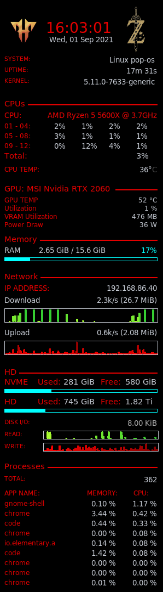

# Linux Profile Config
This holds a list of configurations for linux:
- Conky Themes: http://conky.sourceforge.net/documentation.html
- VSCode Color Themes: https://code.visualstudio.com/api/extension-guides/color-theme
- Git Prompt/Completion for Terminal: https://github.com/git/git/blob/master/contrib/completion/
- Bash "alias" and various other tools

## Installation Instructions for Terminal
This will install "Git prompt/Completion" and Bash "alias".

1. Download this repo to your home directory `~`.
```bash
$ cd ~
$ git clone https://github.com/hibbards01/.profile-config.git
```
2. Source the `.bash_profile` for your terminal. Example:
```bash
# On Ubuntu you can use .bashrc, .bash_profile, etc. to put this command.
source ~/.profile-config/.bash_profile
```

## Conky Themes
### Maroon (conky-themes/maroon-conky.conf)


You will need to edit the "./conky-themes/maroon-conky.conf" to specify your PC specs and images you want to appear on it. Make sure your images are transparent if you want it to look like the example above. Also this is assuming you have 2 monitors and will appear on the right screen 

To use it run command:
```bash
$ conky -c ~/.profile-config/conky-themes/maroon-conky.conf
```

## VSCode Color Theme

### zelda-theme (vscode-themes/zelda-theme)
To install move the folder to `~/.vscode/extensions`. Then select "Zelda (dark)" for the Color theme you want for Visual Studio Code.